class: center, middle

# Fablabs : Concrétisons nos idées ?
### Sébastien NEDJAR (MCF AMU - LIF)

---

# À propos
- Sébastien NEDJAR (@nedseb)

---

# À propos
- Sébastien NEDJAR (@nedseb)
    + Maître de conférences au Département Info de l'IUT  d'Aix. Enseignant spécialiste des Bases de données et chercheur en OLAP Mining au LIF.

    + Membre fondateur du Fab Lab Provence et du L.A.B
    
    + Co-animateur de l'ICSTUG #iutagile.

    + Organisateur des rencontre Beyond Lab.
    
    + Et bien d'autres activités créatives.
---

class: center, middle
#La Fabrication Numérique késako ?!
---

## Qu'est-ce que la Fabrication Numérique ?

L'ensemble des outils numériques (machines CNC et logiciels) permettant de passer de l'idée à un objet.
---

## Qu'est-ce que la Fabrication Numérique ?

L'ensemble des outils numériques (machines CNC et logiciels) permettant de passer de l'idée à un objet.

.center[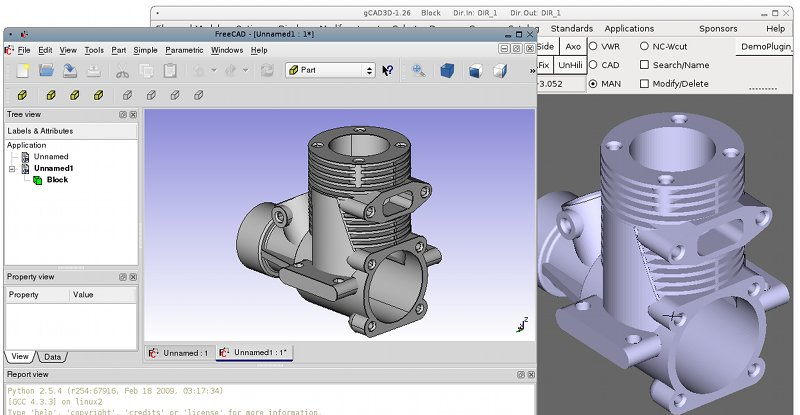]
---

## Qu'est-ce que la Fabrication Numérique ?

L'ensemble des outils numériques (machines CNC et logiciels) permettant de passer de l'idée à un objet.

.center[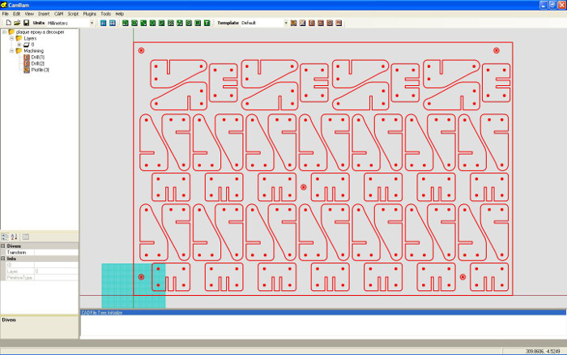]
---

## Qu'est-ce que la Fabrication Numérique ?

L'ensemble des outils numériques (machines CNC et logiciels) permettant de passer de l'idée à un objet.

.center[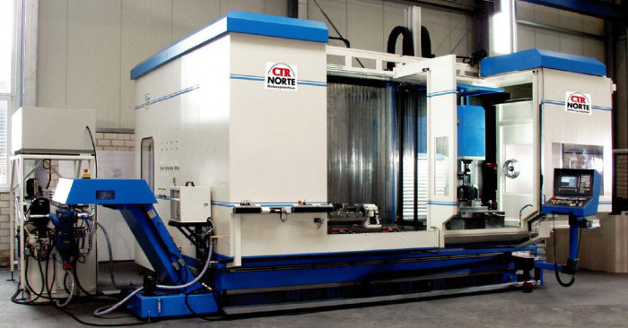]
---

## Qu'est-ce que la Fabrication Numérique ?

L'ensemble des outils numériques (machines CNC et logiciels) permettant de passer de l'idée à un objet.

.center[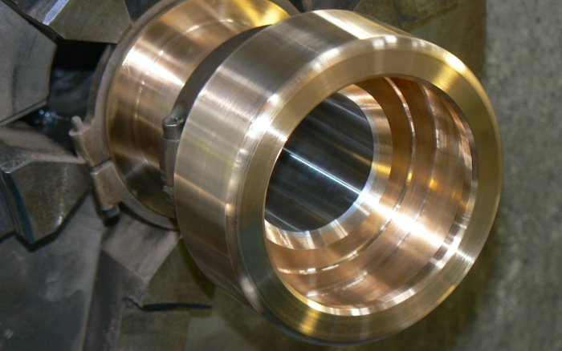]
---

## Pourquoi en parle-t-on autant ?
- Les machines de fabrication personnelle se sont grandement démocratisées,

- Avec Internet le partages des idées est facilité,

- Les brevets qui limitaient la diffusion de l'impression 3D sont tombés en 2009. L'arrivée de ces machines a révolutionné la perception du grand public,

- Emergence de la figure emblématique du Maker et redécouverte du DIY.

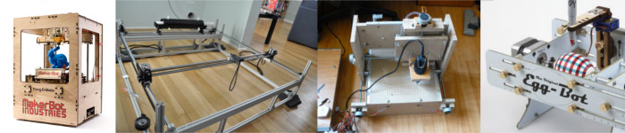
---

class: center, middle
#Fab Lab
---

## Génèse du DIY
  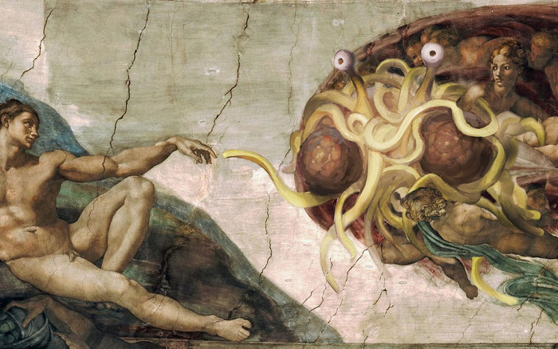
---

## De l'Open Source à l'Open Hardware
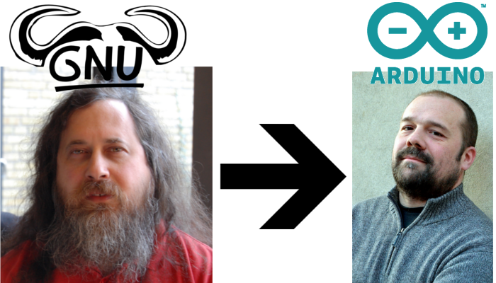
---

## Maker
- Une personne qui pratique le DIY. Elle fabrique ses propres outils/instruments/objets en s'appuyant sur une communauté avec qui elle partage ses projets.

- L'objectif de ce partage est de rendre à la communauté l'aide qu'elle nous a apporté.

- L'effet de levier apporté par les briques mises à disposition de la communauté permet une convergence rapide des projets.

- Moteur de ce que certains appellent la troisième révolution industrielle.
---

## Le Mouvement des Makers
  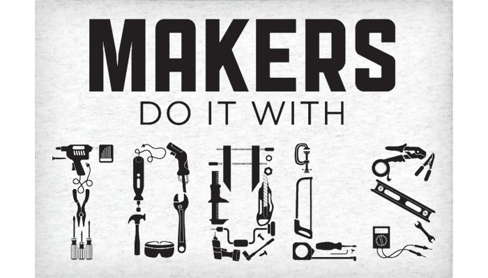
---

## MakerSpace/Hackerspace/Fab Lab ?

- Lieux ouverts, communautaires et collaboratifs

- Mise en commun de ressources et d'outils

- Réalisation de projets variés :
    - Conception d'objets
    
    - Installation technico-artistiques
    
    - Réparation et détournement d'objets

- Échange de compétences.
---
# Qu'est ce qu'un Fab Lab ?

.center[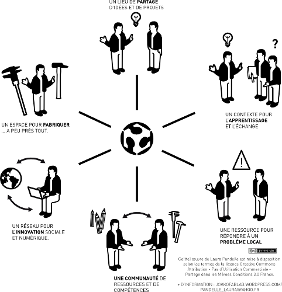]
---

# Autour d'un Fab Lab ?

.center[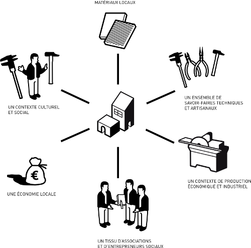]
---

# Que trouve-t-on dans un Fab Lab ?

.center[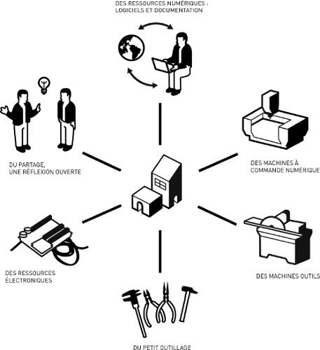]
---

class: center, middle
# Quel est l'intérêt pour une entreprise ?
---

class: center, middle
# le réseau des Fablabs et la coopération avec l'Arménie ?
---

class: center, middle
# How to make (almost) anything
---

# How to make (almost) anything
.center[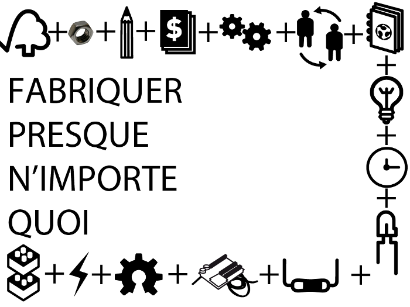]
---

## Du Mobilier Open Source
.center[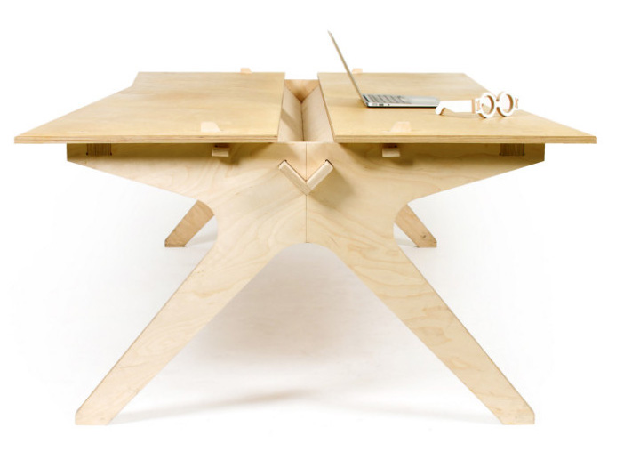]
---

## Du Mobilier Open Source
.center[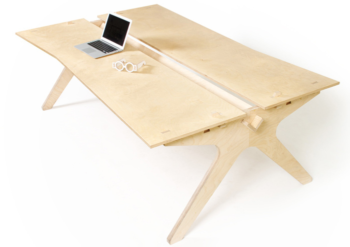]
---

## Du Mobilier Open Source
.center[]
---

## Une Maison Open Source
.center[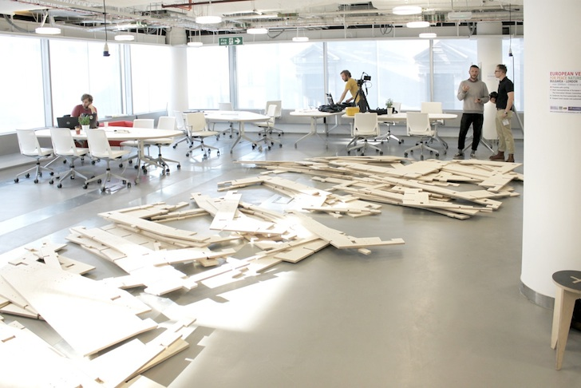]
---

## Une Maison Open Source
.center[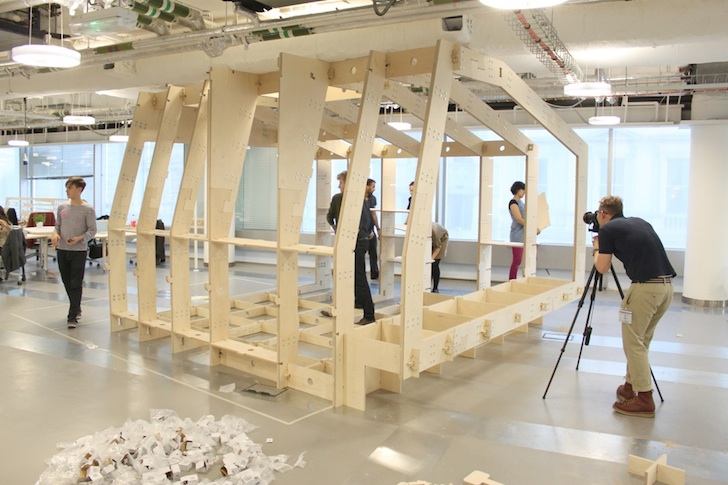]
---

## Une Maison Open Source
.center[]
---

## Une Maison Open Source
.center[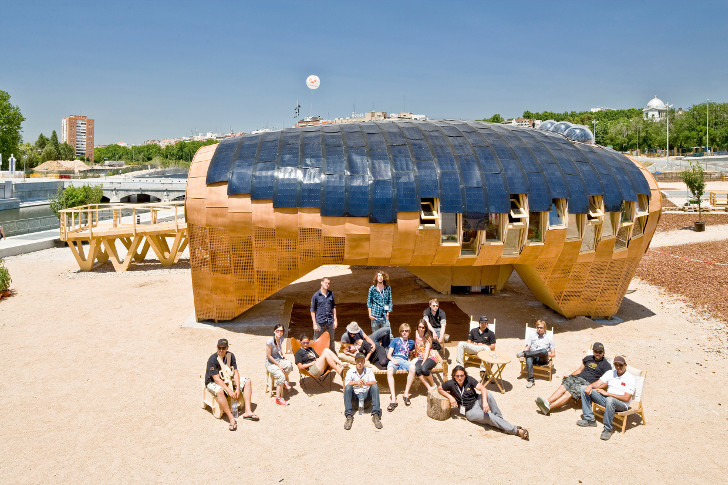]
---

## Un village ?
.center[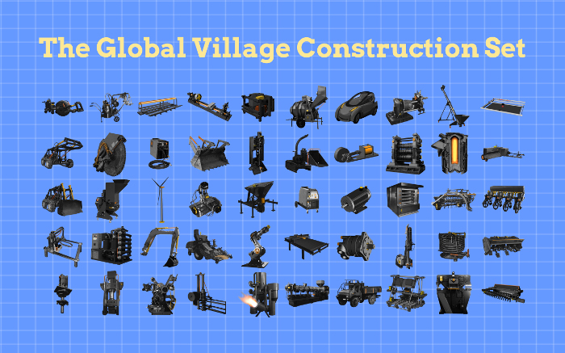]
---

## Un village ?
.center[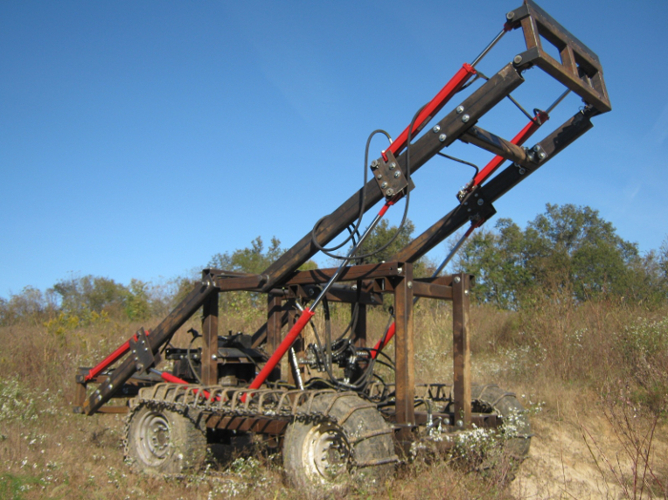]
---
