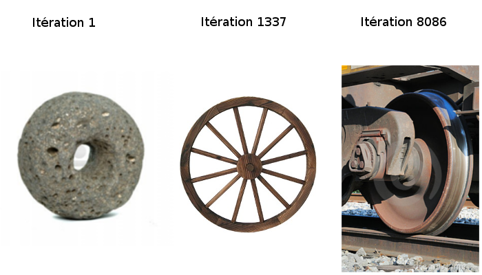
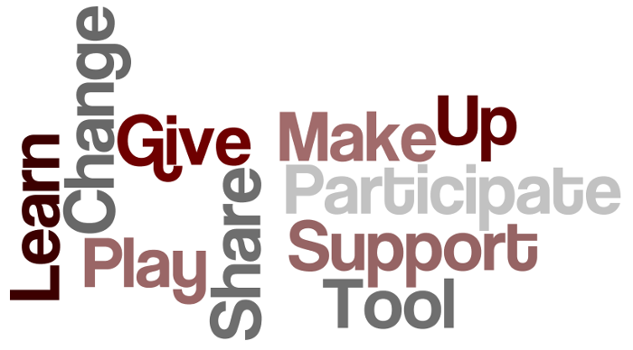

class: center, middle

# La fabrication numérique pour mon entreprise ?
### Sébastien NEDJAR (MCF AMU - LIF)

---

# Disclaimer
Cette présentation se veut non sérieuse et pourra donc contenir du second degré et de 
l'humour de qualité discutable. Veuillez ne pas jeter des tomates (ou tout autre objet) sur l'orateur s'il heurte par moment votre sensibilité.
---

# À propos
- Sébastien NEDJAR (@nedseb)

---

# À propos
- Sébastien NEDJAR (@nedseb)
    + Maître de conférences au Département Info de l'IUT  d'Aix. Enseignant spécialiste des Bases de données et chercheur en OLAP Mining au LIF.

    + Membre fondateur du Fab Lab Provence et du Laboratoire d'Aixpérimentation et de Bidouille.
    
    + Co-animateur de l'ICSTUG #iutagile.
    
    + Et bien d'autres activités étranges (pour avoir plus de détails faire une psychanalyse d'un étudiant m'ayant subi).
---

class: center, middle
#La Fabrication Numérique késako ?!
---

## Qu'est-ce que la Fabrication Numérique ?

L'ensemble des outils numériques (machines CNC et logiciels) permettant de passer de l'idée à un objet.
---

## Qu'est-ce que la Fabrication Numérique ?

L'ensemble des outils numériques (machines CNC et logiciels) permettant de passer de l'idée à un objet.

.center[]
---

## Qu'est-ce que la Fabrication Numérique ?

L'ensemble des outils numériques (machines CNC et logiciels) permettant de passer de l'idée à un objet.

.center[]
---

## Qu'est-ce que la Fabrication Numérique ?

L'ensemble des outils numériques (machines CNC et logiciels) permettant de passer de l'idée à un objet.

.center[]
---

## Qu'est-ce que la Fabrication Numérique ?

L'ensemble des outils numériques (machines CNC et logiciels) permettant de passer de l'idée à un objet.

.center[]
---

## Pourquoi en parle-t-on autant ?
- Les machines de fabrication personnelle se sont grandement démocratisées,

- Avec Internet le partages des idées est facilité,

- Les brevets qui limitaient la diffusion de l'impression 3D sont tombés en 2009. L'arrivée de ces machines a révolutionné la perception du grand public,

- Emergence de la figure emblématique du Maker et redécouverte du DIY.

---

class: center, middle
#Fab Lab
---

## Le Mouvement des Makers
  
---

## Génèse du DIY
- Masse monumentale de connaissance accessible

- Profiter de ce qui est partagé pour apprendre à faire par soi-même

- Création de communautés

- Re-partage pour alimenter les communautés
---

## Génèse du DIY
  
---

## De l'Open Source à l'Open Hardware

---

## Open Source
- Un logiciel est Open Source quand ses sources sont accessibles.

- Disposant des sources, on est libre de les étudier, les modifier pour adapter 
  le logiciel à ses besoins.

- Depuis plus de 30 ans, de nombreuses licences Open Source sont apparues pour 
  diffuser les logiciels Open Source tout en se protégeant (GPL, BSD, MIT, ...).
---

## Open Hardware
- Du "hardware" dont les plans sont accessibles
  - Plans mécaniques

  - Schémas électroniques

  - Codes informatiques

  - Procédés de fabrication

- Le tout sous une licence ouverte
  - Constructible par tous

  - Intégrable dans d'autres objets

  - Modifiable par tous
---

## Open Hardware
"Les bons artistes copient, les grands artistes volent" Picasso   
"Nous n’avons jamais eu honte de voler les excellentes idées" Steve Jobs   

L'humanité a toujours innové en commençant par copier. Exemples :  
  - Le feu  
  - La pierre taillée  
  - La roue   
---

## Open Hardware : la roue

---

## Maker
- Une personne qui pratique le DIY. Elle fabrique ses propres outils/instruments/objets en s'appuyant sur une communauté avec qui elle partage ses projets.

- L'objectif de ce partage est de rendre à la communauté l'aide qu'elle nous a apporté.

- L'effet de levier apporté par les briques mises à disposition de la communauté permet une convergence rapide des projets.

- Moteur de ce que certains appellent la troisième révolution industrielle.
---

## Effet de mode ou mouvement de fond ?
- Un exemple d'émergence d'une communauté auto-organisée collaborative et innovante.

- Le mouvement des makers est une forme de passage de la bidouille informatique à la bidouille des objets physiques.

- Nous sommes à un instant particulier de l'Histoire : la révolution de la fabrication numérique pour tous.

- Comme pour l'informatique dans les années 80, on est à un moment d'effervescence qu'il faut péréniser.

- Peut-être le début de la transformation radicale du modèle industriel actuel ?
---

## Le manifeste du mouvement des makers

---

## MakerSpace/Hackerspace/Fab Lab ?

- Lieux ouverts, communautaires et collaboratifs

- Mise en commun de ressources et d'outils

- Réalisation de projets variés :
    - Conception d'objets
    
    - Installation technico-artistiques
    
    - Réparation et détournement d'objets
    
    - Et bien pire encore

- Échange de compétences.
---
# Qu'est ce qu'un Fab Lab ?

.center[]
---

# Autour d'un Fab Lab ?

.center[]
---

# Que trouve-t-on dans un Fab Lab ?

.center[]
---

## Laboratoire d'Aix-périmentation et de bidouille

- Fab Lab ouvert à tous (*i.e* même à moi pour vous dire),

- Une communauté de Makers avec des profils très variés (Ingénieurs, Enseignants, Chercheurs, Étudiants, Hobbyistes, passionnés, ... ),

- Soirées mensuelle l'avant dernier vendredi du mois (présentation des projets, conférences, ateliers bidouille et malbouffe),

- Notre credo : être un Fab Lab qui essaime la philosophie des makers sur tout le territoire provençal.

.center[]
---

## Laboratoire d'Aix-périmentation et de bidouille
Pour en savoir plus :  
  - Site Web : http://www.labaixbidouille.com/ 

  - Twitter : @LabAixBidouille  

  - Github : https://github.com/LabAixBidouille 

  - Google groups : lab-aix@googlegroups.com

  .center[]
---

## Laboratoire d'Aix-périmentation et de bidouille
- Gérer un atelier offrant au public et tout particulièrement aux adhérents du lieu des outils de fabrication numérique;

- Promouvoir l’expérimentation par la pratique et la réalisation de projets au moyen d’outils mis à disposition dans l’atelier, que ces projets aient une vocation scientifique, technique, artistique, culturelle ou économique;

- Agir pour la promotion des sciences et techniques auprès du grand public en organisant et participant à des évènements et en accueillant tout visiteur et en lui offrant des opportunités de s’investir auprès de l’association;

- Favoriser la transmission et les échanges de savoir-faire et de connaissances;
---

## Laboratoire d'Aix-périmentation et de bidouille
- Promouvoir l’usage et les contributions à l’informatique, au matériel et aux contenus Libres;

- Promouvoir la ré-appropriation par le grand public des capacités d’analyse, de conception, de fabrication et de modification d’objets technologiques, c’est-à-dire la « bidouillabilité »;

- Proposer aux entreprises locales, associations et institutions des services favorisant leur développement;

- Entretenir des réseaux de relations destinés à la création d’entreprises et d’opportunités commerciales sur la base des projets réalisés au sein de l’association.
---

class: center, middle

# How to make (almost) anything

---

# How to make (almost) anything
.center[]
---

## Du Mobilier Open Source
.center[]
---

## Du Mobilier Open Source
.center[]
---

## Du Mobilier Open Source
.center[]
---

## Une Maison Open Source
.center[]
---

## Une Maison Open Source
.center[]
---

## Une Maison Open Source
.center[]
---

## Une Maison Open Source
.center[]
---

## Un village ?
.center[]
---

## Un village ?
.center[]
---

class: center, middle

# Quel est l'intérêt pour une entreprise ?
---

# Un mode de fonctionnement
- Collaboratif

- Horizontalité

- Auto-organisation

- Transversalité

- Émergence
---

# Des valeurs humaines
- Confiance

- Ouverture

- Courage et acceptation du changement

- Des humains d'abord
---

# Des pratiques
- Releaser au plus tôt

- Feed Back de la communauté

- Amélioration continue

- Cycles courts/itérations
---

# Fail Fast, Fail Often
- Démocratisation des outils

- Démocratisation du risque

- Échouons souvent pour un jour réussir

- Ticket d'entrée plus faible pour l'innovation

- La vraie révolution est dans la démocratisation de l'innovation.
---

class: center, middle
# Les « stars » de la fabrication numérique
---

class: center, middle
# Fabrication numérique, travail collaboratif et décloisonnement
---